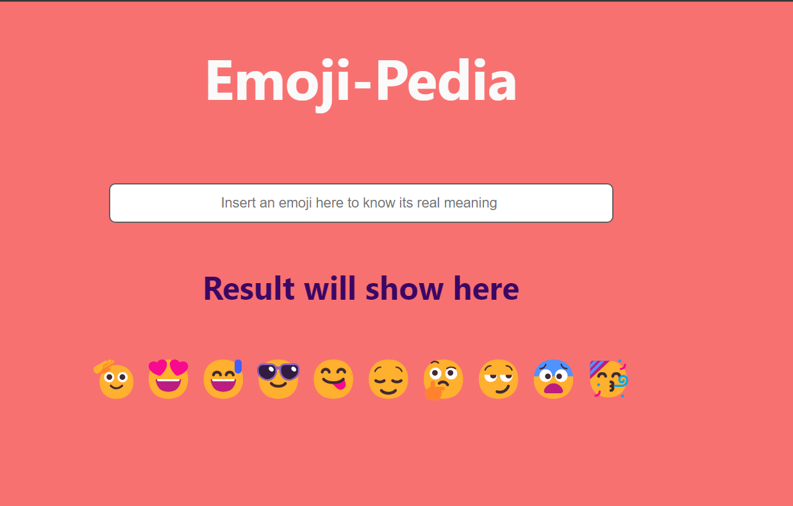

# emojiPedia mini show meaning app
By sourabh pande

 

---
## This is an emojipedia app made with pure React Js it will help you to find meaning of each emoji.

---
## Technologies used

> JavaScript

> HTML

> CSS

> React
---

 

## 
---
